# Robotics Python

Robotics Mathematical modeling and theory with Python (learning through extensive numerical simulations and animations.)

> Original materials from [Pranav Bhounsule's robotics lecture](https://www.youtube.com/watch?v=0dBrRF-M8mU&list=PLc7bpbeTIk7561Sg9v65uKYPa8_AJtkG9) and [Github](https://github.com/pab47/robotics) 

### Dev Env Setup

1. Install Python - Version greater than 3.8.0
2. Install required packages 

```bash 
# please use pip or pip3
pip install numpy sympy scipy control matplotlib 

# for windows users
pip install msvc-runtime kiwisolver
```

---

*  Lecture 1 - python basics for robotics programming 

<p align="center">
    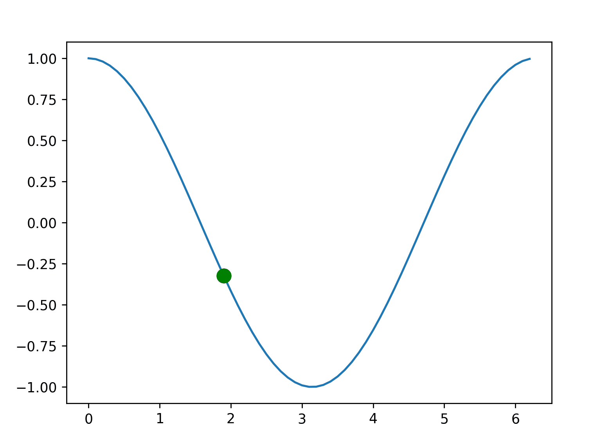
</p>

* Lecture 2 - Homogeneous Matrix and Forward Kinematics

<p align="center">
    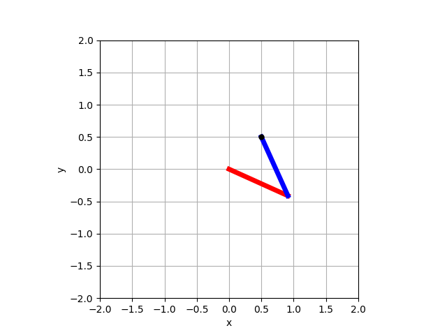
</p>

* Lecture 3 - Differential Drive robot's FK and IK, Trajectory Following

<p align="center">
    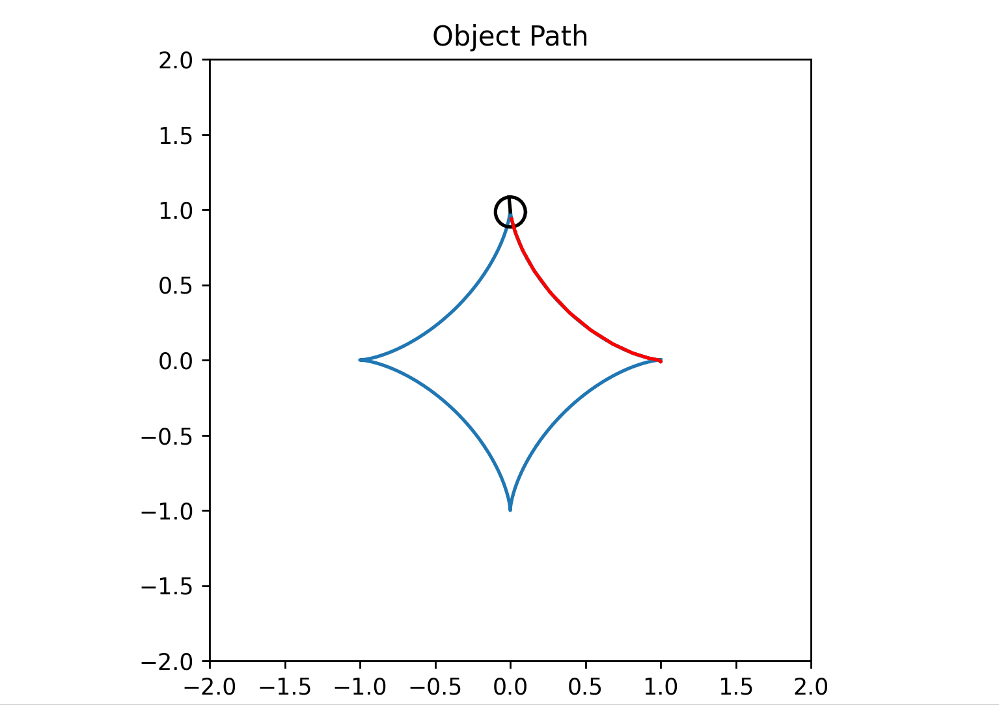
    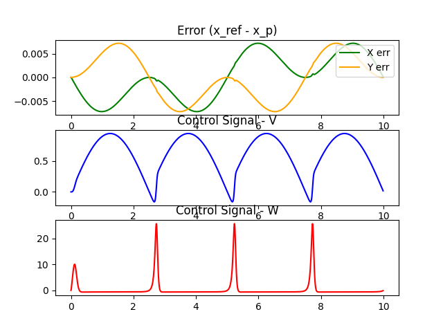
</p>

* Lecture 4 - Equations of motion, Expressing Dynamics through python

<p align="center">
    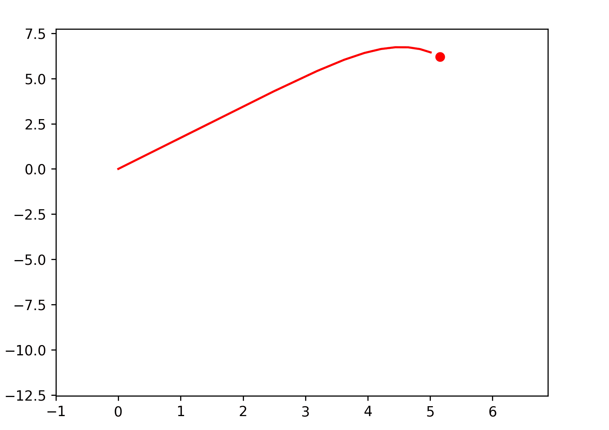
</p>

* Lecture 5 - sympy specification

<p align="center">
    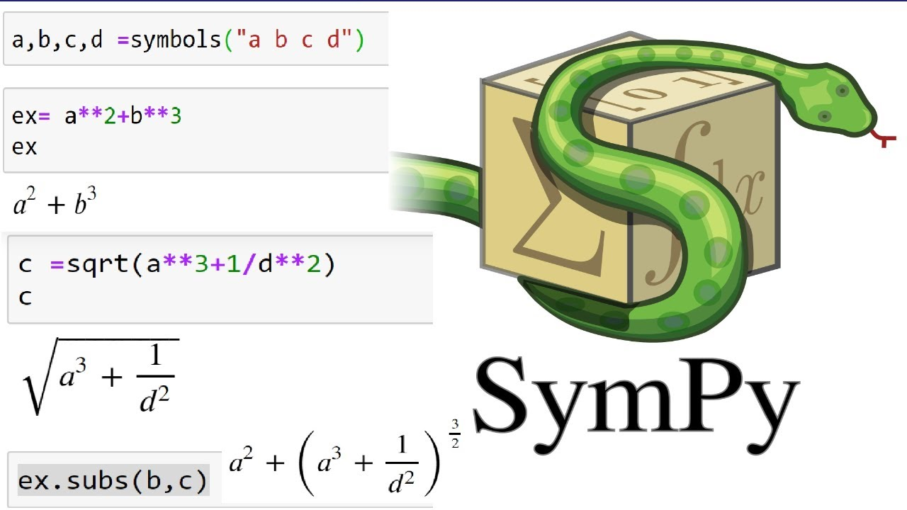
</p>

* Lecture 6 - Dynamics based Double pendulum modeling (without and torque)

<p align="center">
    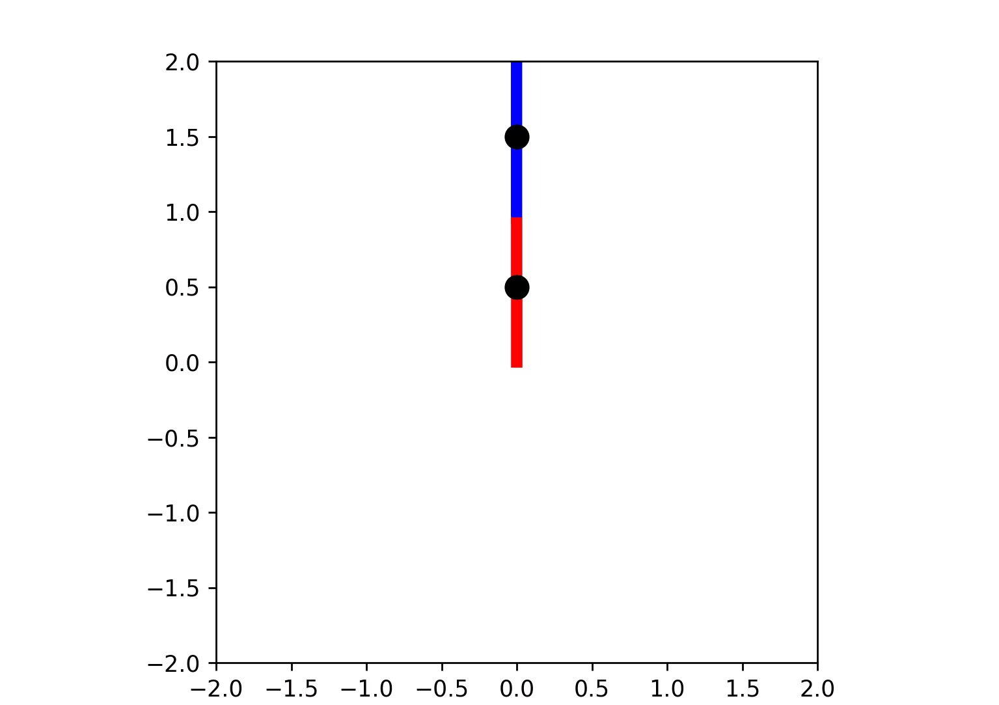
    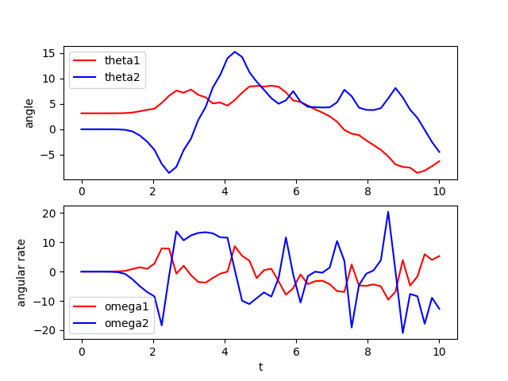
</p>

* Lecture 7 - About Jacobian and it's usages

<p align="center">
    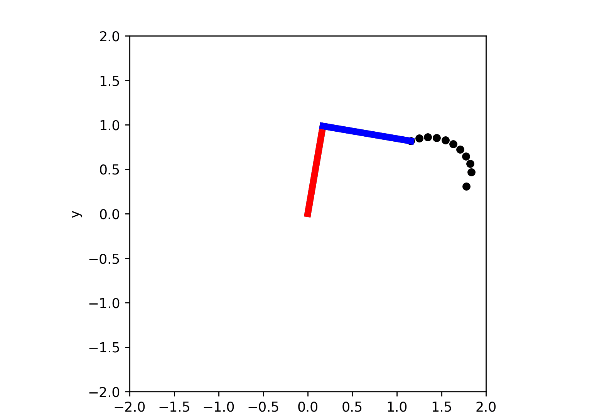
    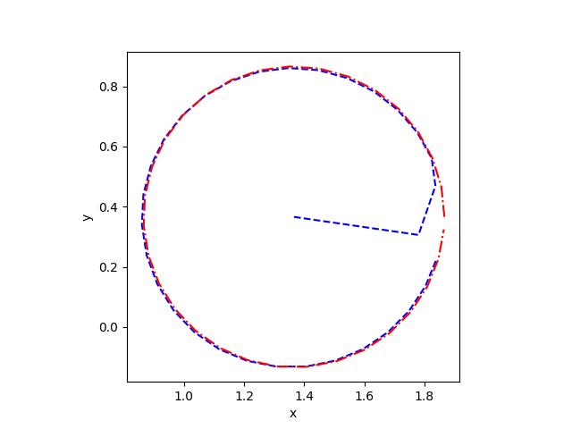
</p>

* Leture 8 - Hybrid Dynamics (jumping ball)

<p align="center">
    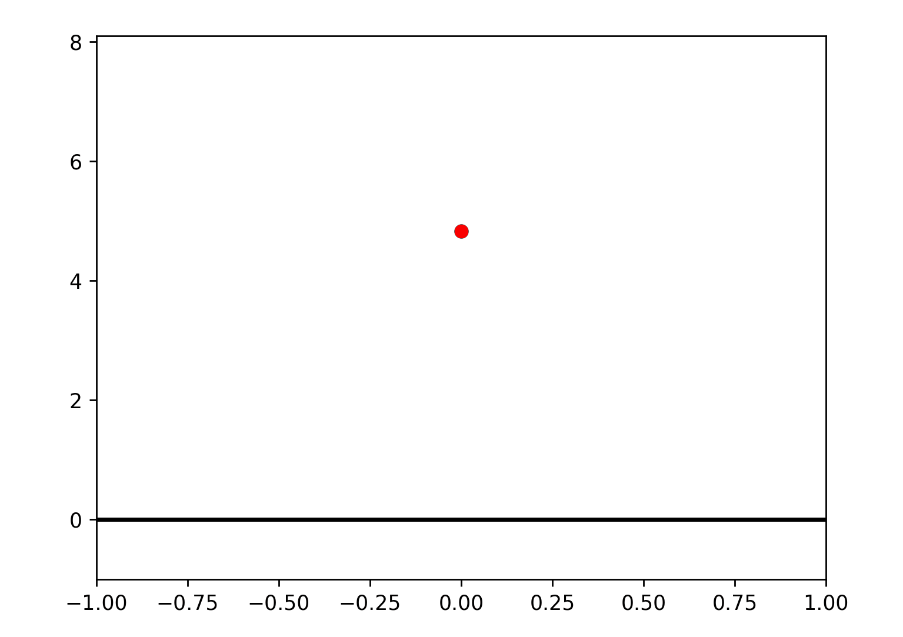
    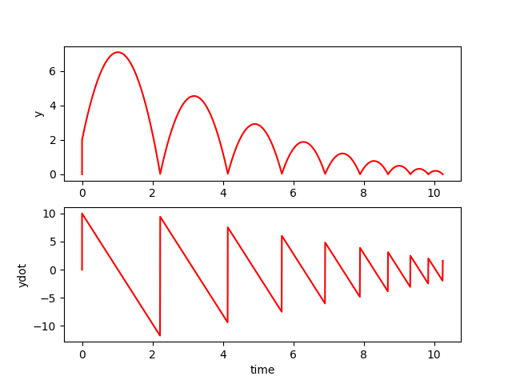
</p>

* Leture 9 - Passive Dynamic Walker Modeling and simulation

<p align="center">
    
</p>

* Leture 10 - Control Optimization

<p align="center">
    
</p>

* Lecture 11 - Trajectory generation

<p align="center">
    
</p>

* Lecture 12 - Control (Feedback Linearization)

<p align="center">
    
</p>

* Lecture 13 - Control (Linear Control)

<p align="center">
    
</p>

* Lecture 14 - Bicopter Modeling and Simulation

<p align="center">
    
</p>

* Lecture 15 - Observability and Controllability

<p align="center">
    
</p>

* Lecture 16 - 3D rotations

<p align="center">
    
</p>

* Lecture 17 - 3D dyanmics (free fall in 3D world)

<p align="center">
    
</p>

* Lecture 18 - 3D quadcopter modeling and control

<p align="center">
    
</p>

* Lecture 19 - 3D manipulator modeling and Inverse Kinematics

<p align="center">
    
</p>


---

### Ongoing tasks

- [ ] Lecture notes
- [ ] Simulation program examples - Isaac Sim, Ignition
- [ ] Youtube Tutorial
- [ ] Real Robot Example